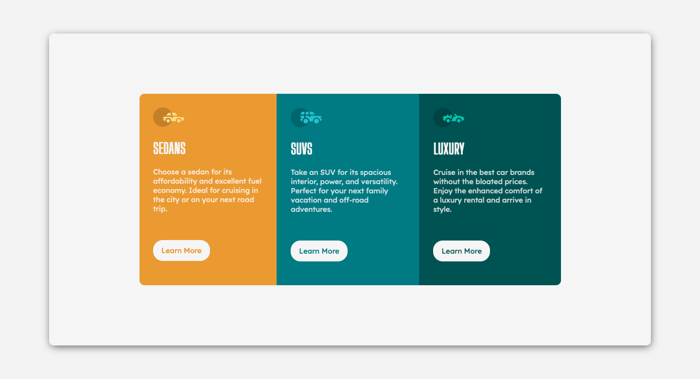

# Frontend Mentor - 3-column preview card component solution

This is a solution to the [3-column preview card component challenge on Frontend Mentor](https://www.frontendmentor.io/challenges/3column-preview-card-component-pH92eAR2-). Frontend Mentor challenges help you improve your coding skills by building realistic projects.

## Table of contents

- [Overview](#overview)
- [Screenshot](#screenshot)
- [Built with](#built-with)
- [Continued development](#continued-development)
- [Author](#author)

## Overview

### The challenge

Users should be able to:

- View the optimal layout depending on their device's screen size
- See hover states for interactive elements

### Screenshot

### Links

- Solution URL: [https://github.com/Qilat/3ColumnPreviewCard](https://github.com/Qilat/3ColumnPreviewCard)
- Live Site URL: [https://qilat.github.io/3ColumnPreviewCard/](https://qilat.github.io/3ColumnPreviewCard/)

### Built with

- Semantic HTML5 markup
- CSS custom properties
- Flexbox
- SCSS

### Continued development

- Find a way to fix button at the bottom of their parent to prevent them from moving when resizing

## Author

- Website - [Qilat](https://www.qilat.fr)
- Frontend Mentor - [@Qilat](https://www.frontendmentor.io/profile/qilat)
- Twitter - [@Qilatmc](https://www.twitter.com/qilatmc)
